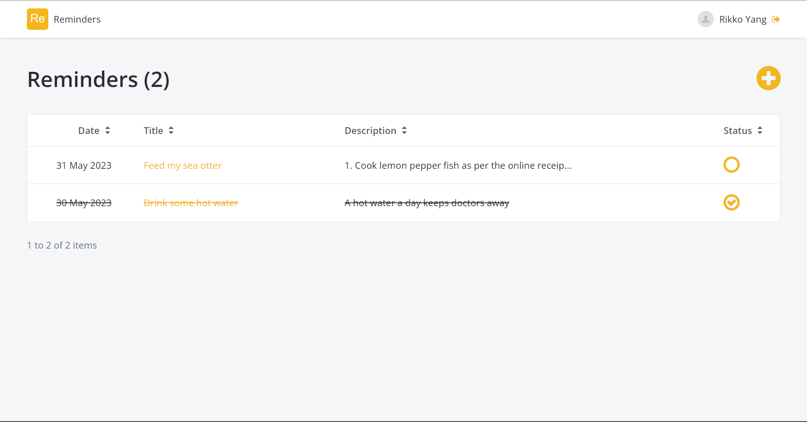
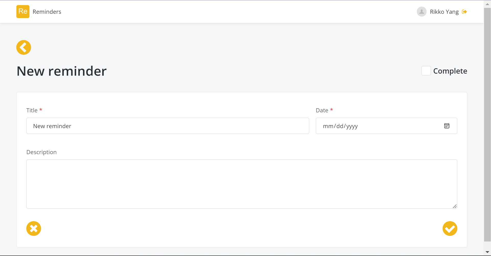

      

      

A web-based reminder app that features a mordern UI design and a smooth user experience. Users can manager their list of reminders effortlessly by including a title, description, and a completion status. Constructed with [OutSystems 11](https://www.outsystems.com/). 

Click [here](https://personal-vcgtfgt9.outsystemscloud.com/Reminders/) to view a demo of this project. 

<u>Technologies</u>: CSS • OutSystems • SQL