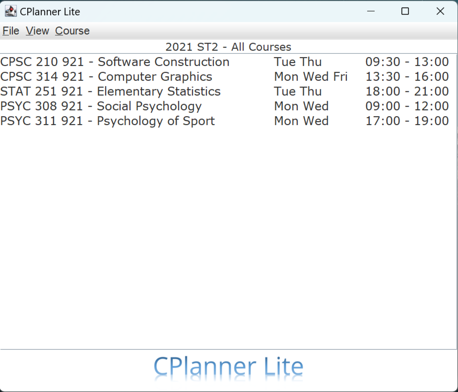
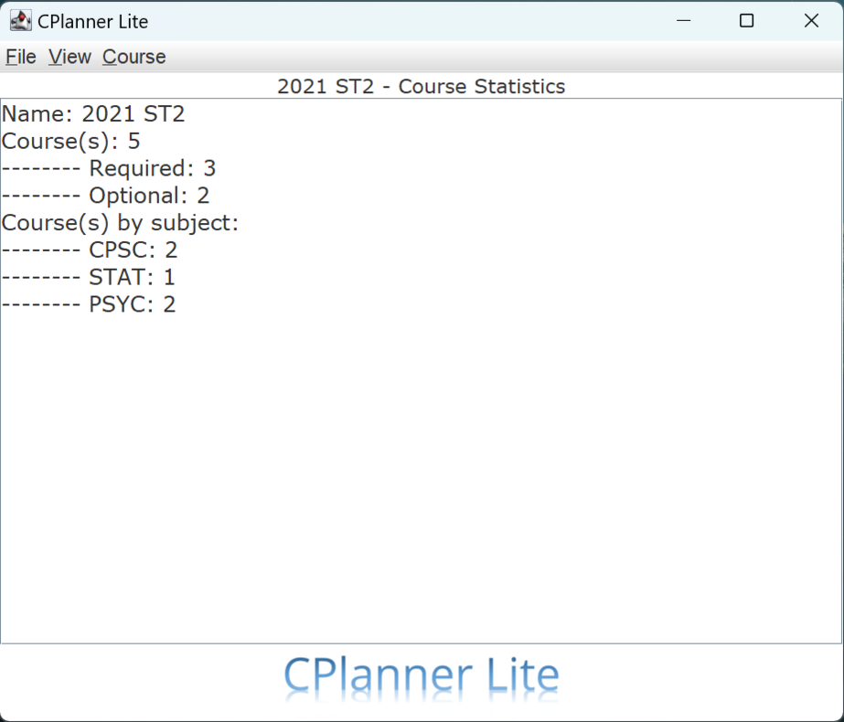
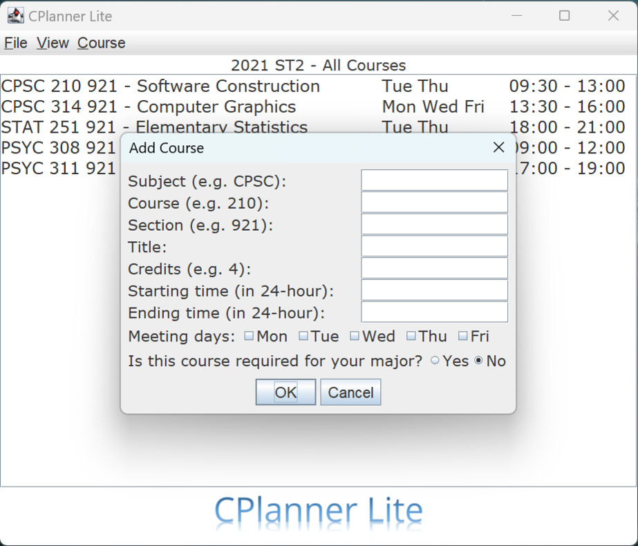
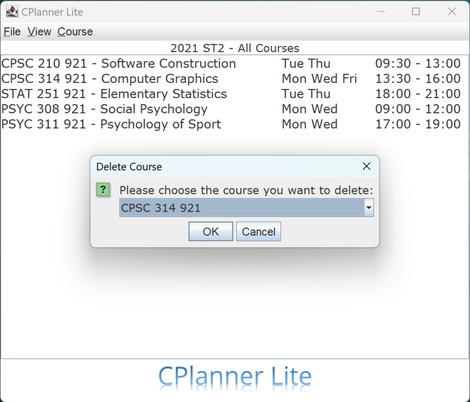

      
      

      
      

A course planner application with Swing GUI, allowing users to manage a local worklist of university courses using JSON. Users can add/delete/star the courses in the worklist, view summaries of the worklist, and receive reminders when courses are conflicting.

View this project on [GitHub ](https://github.com/yhouyang02/CPlannerLite).

<u>Technologies</u>: Swing • Java • JSON • JUnit
