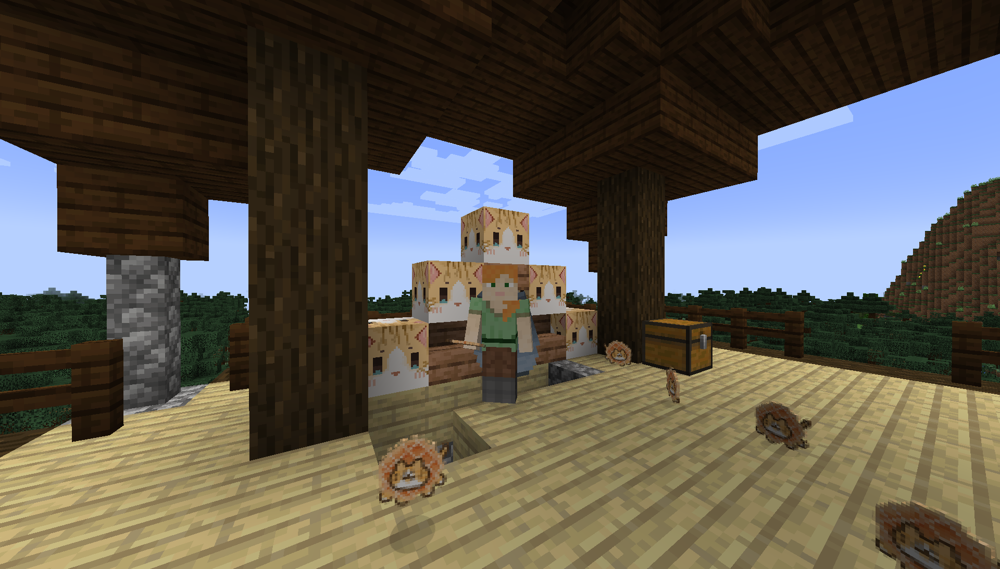

<!-- markdownlint-disable MD033 -->

      
      <em> Figure 1: Cat building blocks and cookies </em>

A game mod that brings more cat elements to Minecraft 1.18.2. With installation, players can construct their game worlds with cat blocks, decorate their houses with cat items, and summon cute kittens. Built with Java 17 and [Fabric APIs](https://fabricmc.net/).

View this project on [GitHub ](https://github.com/yhouyang02/minecraft-more-cats).

<u>Technologies</u>: Fabric • Gradle • Java • JSON
