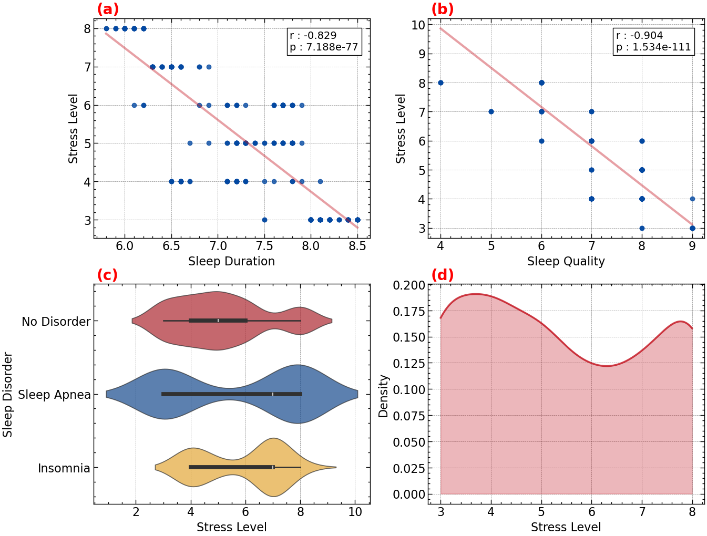

<!-- markdownlint-disable MD033 -->
<!-- markdownlint-disable MD059 -->

Stress has become a critical public health concern, yet its relationship with daily habits remains complex to quantify. Using the [Sleep Health and Lifestyle Dataset](https://www.kaggle.com/datasets/uom190346a/sleep-health-and-lifestyle-dataset), we investigated the predictive power of sleep metrics on stress levels. Through EDA and linear modeling, we identified an inverse relationship between sleep metrics and stress, achieving an $$R^2$$ score of $$0.51$$. Residual analysis suggests non-linear relationships that a linear model may not fully capture. These findings highlight the potential of using simple lifestyle metrics for stress assessment, while also indicating the need for more complex modeling techniques to account for the nuanced nature of sleep health.

      
      <em> Figure 1: Exploratory data analysis  </em>

The analysis was built on top of these key dependencies:
    - Build automation: GNU Make
    - Data modelling: pandas, scikit-learn
    - Data validation: Deepchecks, Pandera
    - Data visualization: Altair, Matplotlib, SciencePlots, Seaboarn
    - Dependency management: Conda, conda-lock, Docker
    - Reporting: Quarto, Jupyter

Click [here](https://www.yhouyang.me/sleep-disorder-analysis/sleep-disorder-analysis.html) to view the research report.

To replicate the analysis, download the latest release from  [GitHub ](https://github.com/yhouyang02/sleep-disorder-analysis) and follow the instructions in the README file. The repository includes the dataset, Jupyter notebook, and dependency configuration.

<u>Technologies</u>: Docker • GNU Maker • Quarto • scikit-learn
