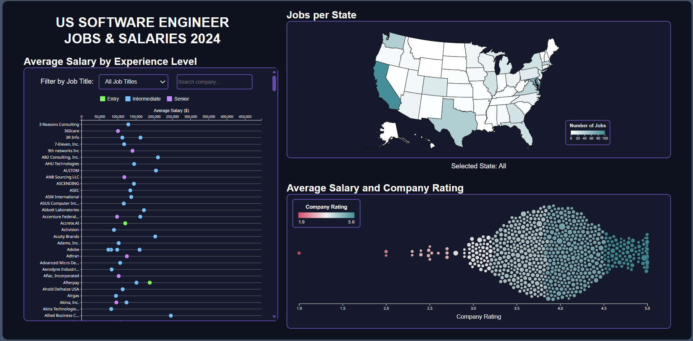
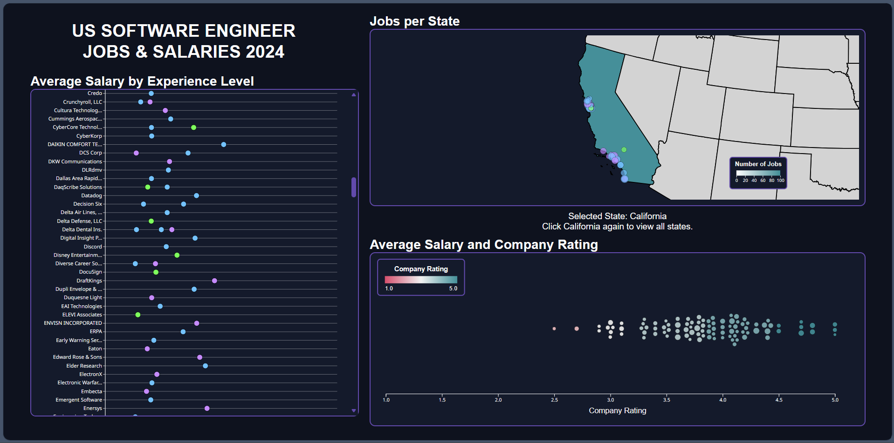

<!-- markdownlint-disable MD033 -->
<!-- markdownlint-disable MD059 -->

This project delivers an interactive data dashboard that visualizes software engineering job postings in the United States in 2024. It consolidates key insights into a single, easy-to-use interface so users can quickly explore the market and understand compensation trends.

      
      <em> Figure 1: Dashboard overview </em>

      
      <em> Figure 2: State-level map view </em>

Highlights of the dashboard:

- **Scatter plot**: experience-salary analysis across companies with adjustable axes and a drop-down filter.
- **Bubble chart**: interactive bubble chart where each bubble represents a company with its rating.
- **Geographic distribution map**: a two-level (nation/state) map of the United States, featuring its user-friendly interactive plays and smooth animation.
- **Bidirectional filtering**: selecting a state in the map filters the bubble chart to display only companies in that state, and clicking a company bubble triggers a zoom animation to that company's state on the map.
- **Tooltip on hover**: detailed information about companies and job postings.

The positioning of United States cities on the map view relies on a local copy of the [TopoJSON library (v3.0.2)](https://github.com/topojson/topojson/releases/tag/v3.0.2). The geographic data, including the latitudes and longitudes of United States cities used in this project, depends on a publicly accessible [dataset](https://github.com/topojson/us-atlas) built from the U.S. Census Bureau.

Click [here](https://yhouyang02.github.io/us-software-engineer-jobs-salaries-2024/) to view the live dashboard. You may need to adjust your browser zoom level for the best experience.

View this project on [GitHub ](https://github.com/yhouyang02/us-software-engineer-jobs-salaries-2024).

<u>Technologies</u>: CSS • D3.js • HTML • JavaScript • TopoJSON
