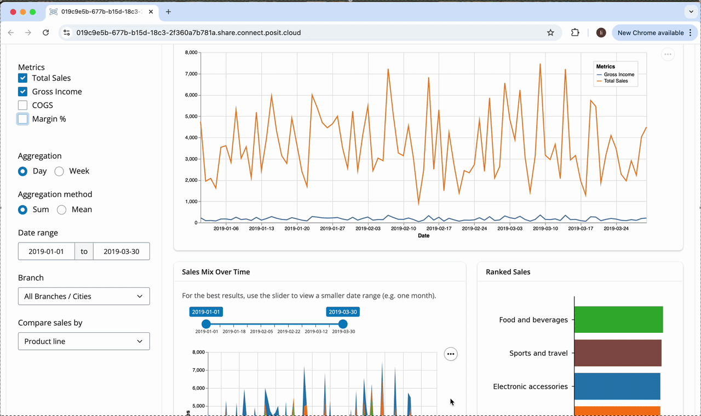

Walmonitor is a dashboard for visualizing the performance of Walmart stores across different branches and time periods. It provides insights into sales trends, product line rankings, and other key performance indicators to help stakeholders make informed decisions.

The primary users of this dashboard are Walmart store managers and regional directors who need to monitor store performance and make data-driven decisions. Prospective users also include analysts and executives who require insights into sales trends and product performance across the company.

      
      <em> Figure 1: Dashboard demo </em>

The app also has an LLM Chatbot tab that uses the `gpt-4.1-mini` model with pre-fed data and knowledge base to provide an interactive interface for users to ask questions about Walmart sales data. The chatbot can generate charts and tables based on user queries, making it easier for users to explore the data and gain insights without needing to write complex queries themselves.

Click [here](https://yhouyang02-walmonitor.share.connect.posit.cloud/) to view a live demo of the dashboard (adjust your browser zoom level for the best viewing experience).

<u>Technologies</u>: ibis • playwright • pytest • Python • QueryChat
